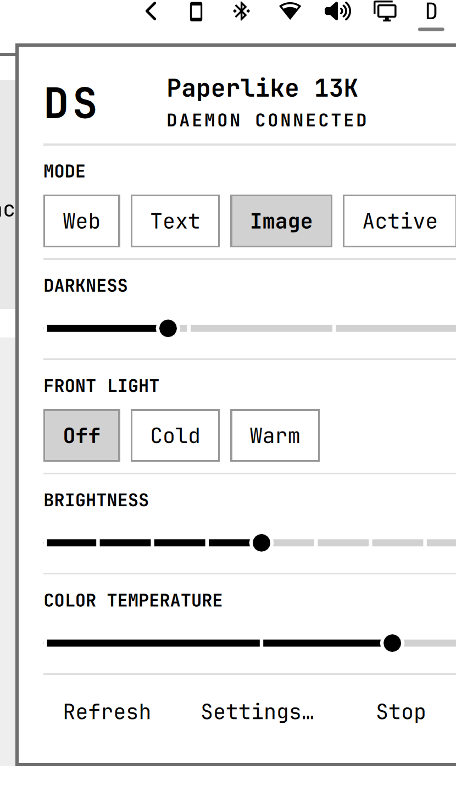

# OmaPaperlike

An [Omarchy](https://omarchy.org) bar widget for the **DASUNG Paperlike 13K
2025 Color** e-ink display. Click the bar icon → get a popup with mode,
brightness, front-light, color temperature, dithering, and force-refresh
controls — no more launching a separate GUI app every time you want to tweak
the panel.

This plugin is just the **bar widget / popup UI**. It talks to a small
Python daemon that drives the display's MCU over the CH340 USB-serial
control channel. The daemon is a separate project:

👉 **https://github.com/roflecopter/paperlike13k_linux**

Install that first, run it as a service, and this widget lights up.



---

## Features

- **Mode** — Fast / Fast+ / Balance / Text / Text+ / Read (six MCU modes;
  popup surfaces four content-type labels: Web / Text / Image / Active).
- **Brightness** — 0–64.
- **Speed (darkness threshold)** — 1–8.
- **Color temperature** — 0–5.
- **Front light** — Off / Warm / Cold.
- **Dithering** — MCU dither toggle, plus the `--no-dither-init` mode for
  Windows-like colours.
- **Force refresh** — sends MCU `0x03` to clear ghosting.
- **Status indicator** in the bar — alive / offline dot.

The daemon stays in `--daemon` mode and the widget talks to it over a Unix
socket (`$XDG_RUNTIME_DIR/paperlike.sock`), so toggling a control is
instant and the daemon handles reconnect when the USB cable wiggles.

---

## Hardware

- **Display**: DASUNG Paperlike 13K 2025 Color (3200×2400 @ 37 Hz,
  DSC DisplayPort, 280×220 mm).
- **Connection**: a single USB-C cable carries both DisplayPort Alt-Mode
  video **and** USB 2.0 data for the CH340 control channel. Many 13K
  units have two USB-C ports — only one of them has the data pins. If the
  CH340 doesn't enumerate, try the other port.
- **Control**: CH340 USB-serial, VID `0x1a86` / PID `0x7523`, 115200 8N1.

The Paperlike 13K **HD** (the older monochrome 13K) and the **253** /
**Tab** series have different MCU commands and a different driver path.
This plugin is built for the **2025 Color** only.

---

## Prerequisites

1. **Omarchy** (Arch + Hyprland + Quickshell bar).
2. **Paperlike 13K 2025 Color** connected via a data-capable USB-C cable.
3. **The Paperlike 13K Linux daemon** running as a user service. See:
   - Upstream: <https://github.com/roflecopter/paperlike13k_linux>
   - The upstream README covers `pip install pyserial`,
     `sudo usermod -aG dialout $USER`, and a systemd unit file.

Verify the daemon is alive before installing the widget:

```sh
systemctl --user status paperlike.service
ls -l $XDG_RUNTIME_DIR/paperlike.sock
```

If the socket exists, the widget will go green on first poll.

---

## Install

```sh
omarchy plugin add https://github.com/moonopposite/omapaperlike.git --enable
```

The widget appears in the `right` section of the bar. Move it with:

```sh
omarchy bar move com.github.moonopposite.omapaperlike --section <left|center|right>
```

After install, **restart the Omarchy shell** so the widget mounts:

```sh
omarchy restart shell
```

---

## How it works

```
   Paperlike 13K 2025 Color
        │  USB-C (DP Alt-Mode + USB 2.0)
        │
        ├── DisplayPort stream ────►  Hyprland output (3200×2400 @ 37 Hz)
        │
        └── CH340 USB-serial  ────►  /dev/ttyUSB*
                                          │
                                          ▼
                              paperlike_init_linux.py --daemon
                                          │
                                          ▼
                       $XDG_RUNTIME_DIR/paperlike.sock
                                          │
                                          ▼
                                Panel.qml  (this plugin)
                                          │
                                          ▼
                                    bar icon + popup
```

The QML never talks to the serial port directly. It runs the Python helper
with `--query` / `--mode N` / `--brightness N` etc., and in daemon mode
the daemon receives those over the Unix socket and forwards the
corresponding MCU command.

---

## Configuration

This plugin ships with sensible defaults — four content-type mode labels
(Web / Text / Image / Active), 480 → 360 px popup width, four-notch sliders.
There is no separate config file; edit `Panel.qml` directly if you want
to change the labels, the slider ranges, or the popup size.

---

## Troubleshooting

**Bar icon is dim / grey.**
The daemon isn't reachable. Check:

```sh
systemctl --user status paperlike.service
ls -l $XDG_RUNTIME_DIR/paperlike.sock
python3 ~/.local/share/paperlike13k_linux/paperlike_init_linux.py --query
```

**Popup says "Daemon offline" or shows no values.**
Same as above — the widget polls `--query` every 10 s and falls back to
grey when the socket isn't there.

**Display works but the popup shows stale numbers.**
The widget caches the last query result; it refreshes on every poll tick
and on every command send. If you change a setting from outside the
widget (e.g. a CLI invocation), click the bar icon again to re-poll.

For deeper issues — colour, ghosting, USB reconnect handling — see the
upstream `paperlike13k_linux` repo's troubleshooting doc.

---

## Credits

- **CH340 MCU protocol + Python daemon**: <https://github.com/roflecopter/paperlike13k_linux>
  (and the original macOS script it was adapted from).
- **Bar widget / popup / Quickshell integration**: moonopposite.
- **Omarchy plugin manifest schema**: <https://omarchy.org>.

## License

MIT — see [`LICENSE`](LICENSE).